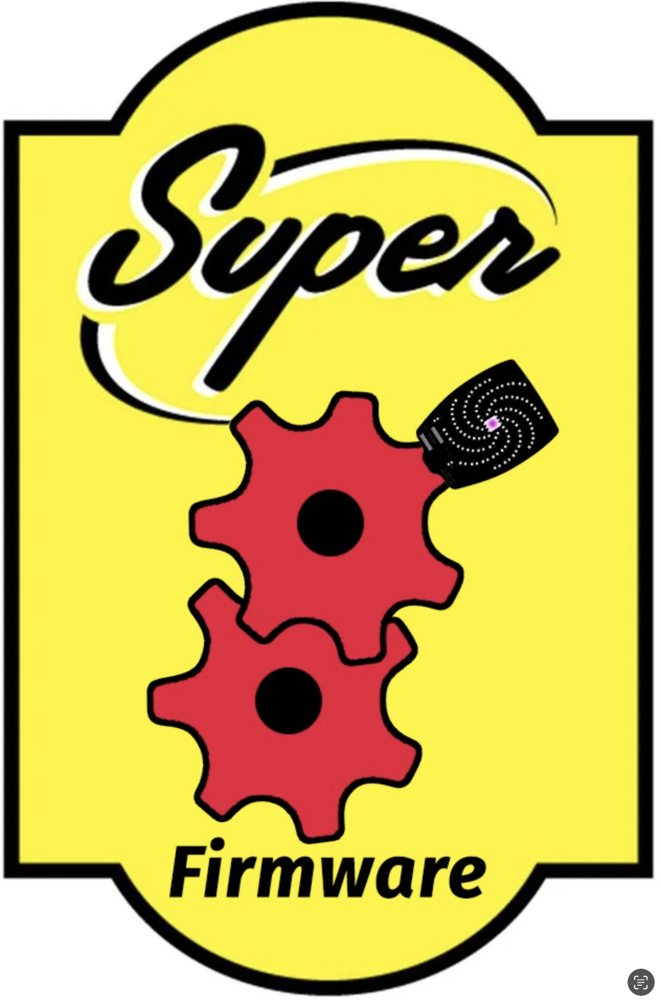

# Super8 Project

By: Aask, Lipo, Flux, and Dr34d



Welcome to Super8, an I2C over MQTT firmware with Wifi Manger designed for the Hackaday Supercon 8 badge! The Super8 Firmware Super Firmware enables seamless communication over WiFi and MQTT, allowing you to connect and manage I2C devices, including Shitty Add-Ons (SAOs), remotely through the MQTT protocol. With this firmware, you can set up SAO and other I2C devices to communicate and exchange data over a WiFi network in real-time.

The registration and MQTT websockets broker project can be found at: https://github.com/sbruton/supercon8-register 

The Super8 Firmware project can be found at:
https://github.com/Aask42/Super8-Firmware 

## Getting Started

To get started with Super8, follow these steps:

### Prerequisites (What you need):
- A Hackaday Supercon 8 badge
- A WiFi network with internet access (defaults to “Supercon” wifi)
- An MQTT broker (e.g., Mosquitto, defaults to “mqtt.super8.dev”)
- The auto-flash shell script provided with the project (tools/flash_cli.sh)  
  

Note: If you’re wondering…who’s MQTT broker this is, it’s a CUSTOM server spun up for Supercon8. Once you run tools/flash_cli.sh you will be asked for an email address and password which will  be used to access your control panel at **https://super8.dev**

PLEASE DO NOT BREAK OUR SERVERS. KTHX. 

Setup Process
1. Clone the Super8-Firmware Repository
- Start by cloning this repository to get the necessary files:
- git clone https://github.com/aask42/Super8-Firmware.git
- cd Super8-Firmware

2. Run the Auto-Flash Script
- Super8 includes an auto-flash.sh shell script that will automatically flash the firmware to your badge. Run the script by entering the following command:
- ```cd tools
    ./tools/flash_cli.sh
    ```
3. Plug in your badge, our Credentials
- During the flashing process, you will be prompted to enter your email address and password. These credentials will be used to connect your badge to the network and communicate with the MQTT broker.
    - Maker TODO: Make sure to errata in https://github.com/sbruton/supercon8-register to avoid connection issues.
4. Connect to Your MQTT Broker
- Once the firmware is flashed, your badge will automatically connect to the specified MQTT broker and start communicating over the WiFi network.

## How It Works: I2C over MQTT
The Super8 Super Firmware is designed to transmit I2C data over MQTT, allowing multiple devices to share information across a WiFi network. By leveraging MQTT’s lightweight and efficient messaging protocol, Super8 can send I2C signals, commands, and data across devices with minimal latency.
- I2C Devices: Super8 allows you to connect standard I2C devices, including SAOs, to your badge.
- MQTT Communication: Data is sent over the network to your MQTT broker, where it can be accessed and used by other devices on the network.

## Adding Your SAO Device
To add an SAO device to the Super8 network, it’s essential to configure the I2C JSON format for compatibility with the firmware. This configuration ensures that Super8 can recognize, manage, and communicate with your device over MQTT.

I2C JSON Format
// Coming Soon: Details on the JSON structure to register your SAO device with Super8
This section will outline the JSON format required for proper configuration and support. Once formatted, the JSON payload will allow seamless integration with the Super8 network and enable real-time device management over MQTT.

## Contributing
If you’d like to contribute to the Super8 project, feel free to submit pull requests or open issues. We welcome any contributions that enhance the firmware’s functionality or make it easier to use.
Enjoy the power of Super8 and get connected!

